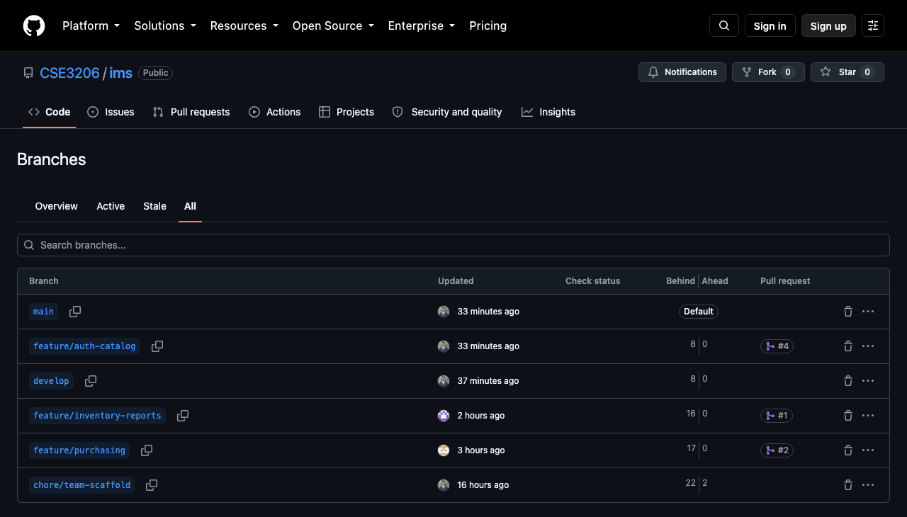
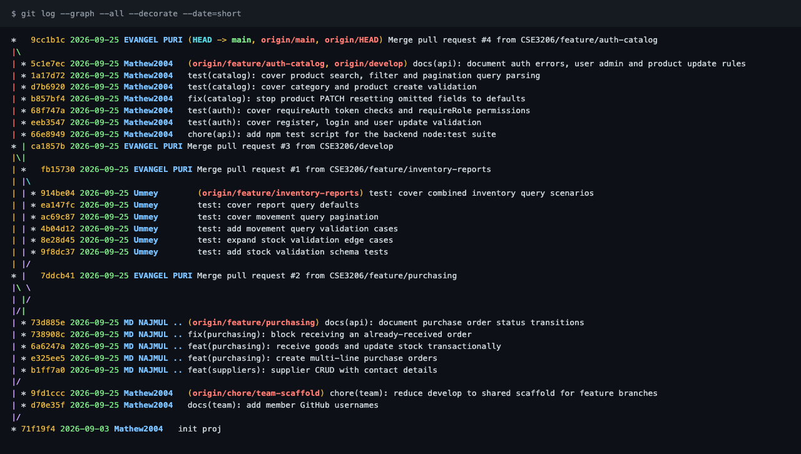
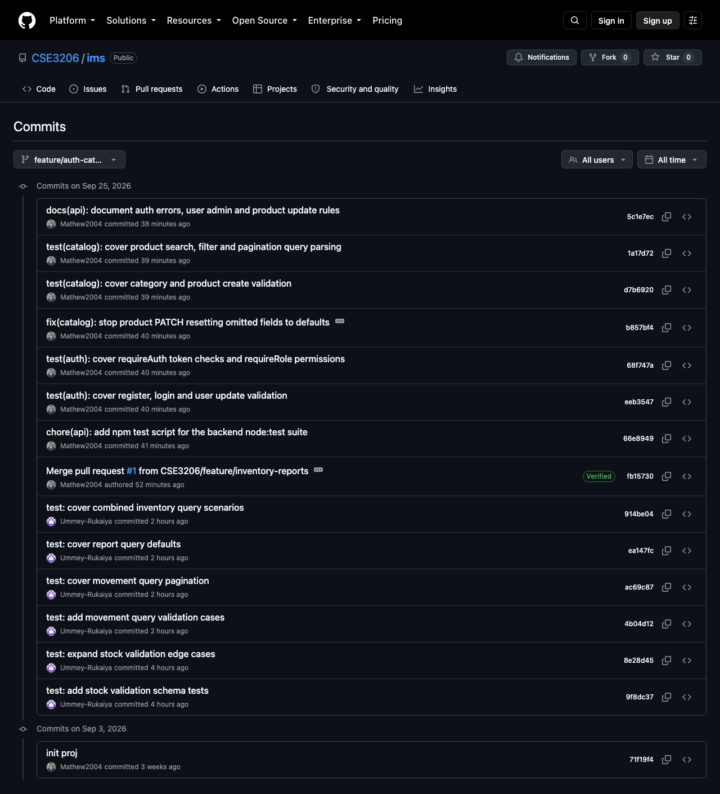
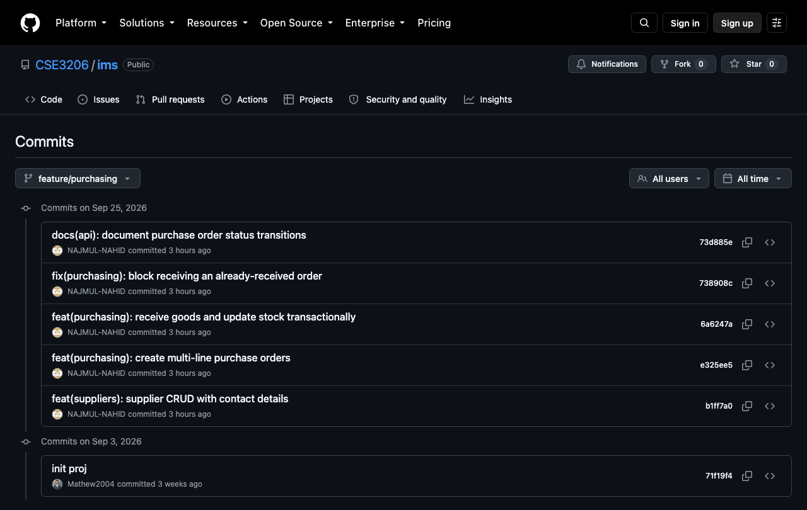
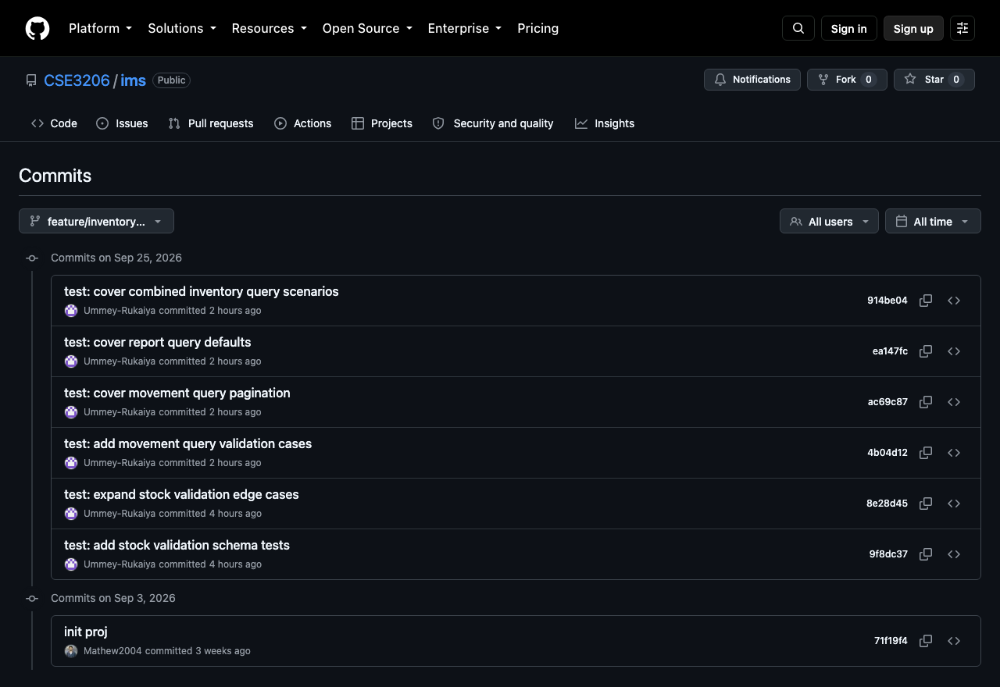
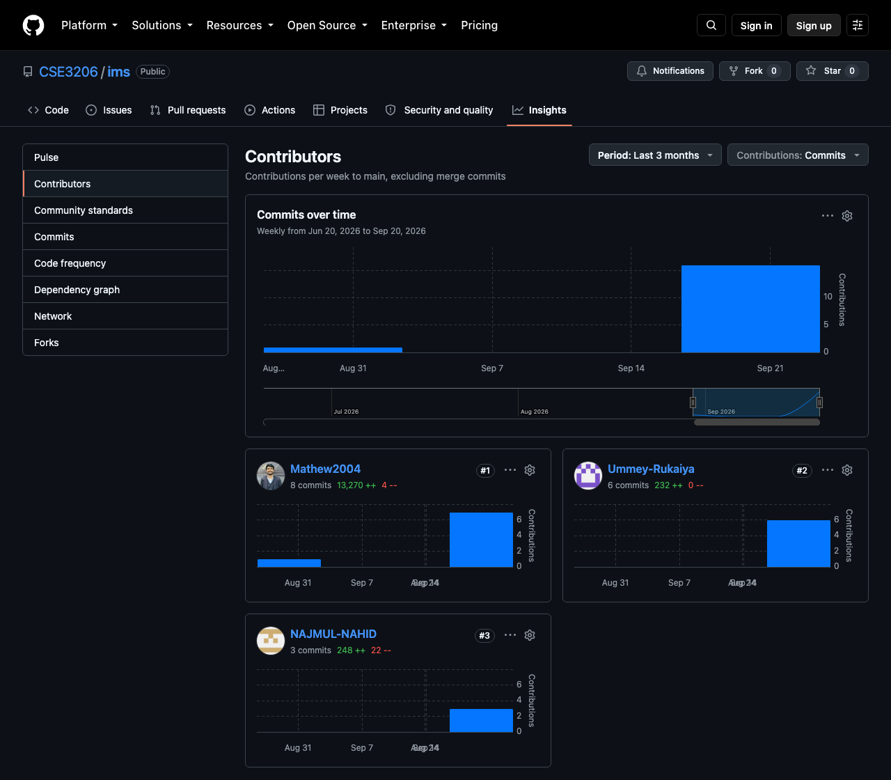
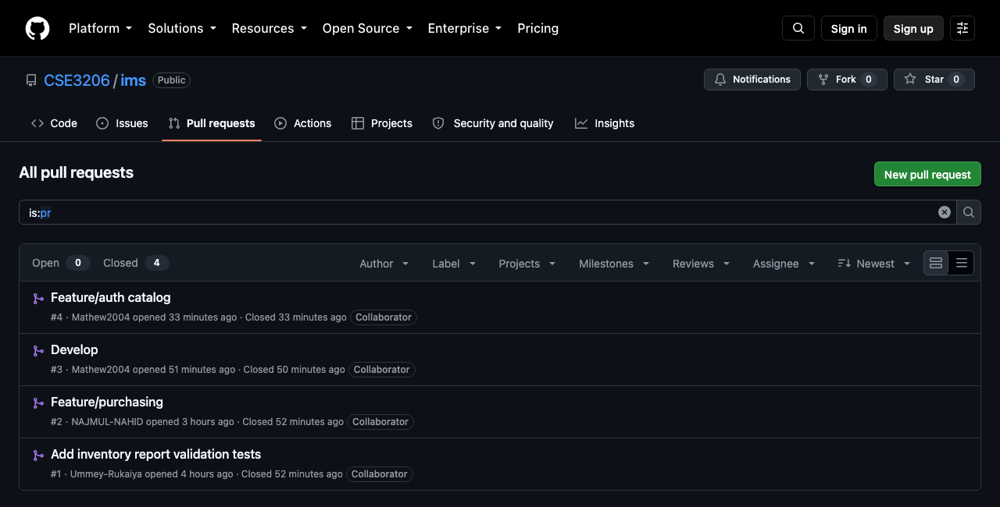
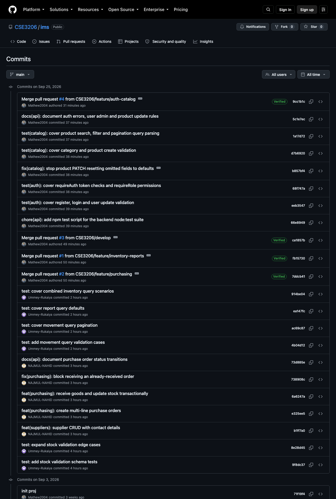

# Lab Report — Team Collaboration with Git & GitHub

**Course:** CSE3206
**Project:** Inventory Management System (IMS)
**Repository:** <https://github.com/CSE3206/ims>
**Date:** 25 September 2026

| Member | GitHub | Role | Branch |
|--------|--------|------|--------|
| Evangel Puri (Evan) | [`Mathew2004`](https://github.com/Mathew2004) | Integration Lead | `feature/auth-catalog` |
| MD Najmul Islam Nahid (Najmul) | [`NAJMUL-NAHID`](https://github.com/NAJMUL-NAHID) | Developer | `feature/purchasing` |
| Ummey Rukaiya (Rukaiya) | [`Ummey-Rukaiya`](https://github.com/Ummey-Rukaiya) | Developer | `feature/inventory-reports` |

---

## 1. Objective

The aim of this lab was to build a software project as a team of three while
practising a real Git collaboration workflow:

- split the work so that each member owns a separate part of the system,
- develop each part on its own **feature branch**,
- integrate the work through **pull requests (PRs)** on GitHub,
- keep a readable history using **Conventional Commit** messages, and
- produce evidence of the process (commit history, branch graph, PRs).

## 2. Project overview

The IMS is a full-stack web application for a small warehouse. It tracks
products, buys stock in from suppliers, sells stock out to customers, and keeps
an audit trail of every unit that moves.

| Layer | Technology |
|-------|------------|
| Frontend | React 18, Vite, React Router |
| Backend | Node.js, Express |
| Database | PostgreSQL (Neon), Drizzle ORM |
| Auth | JWT + bcrypt, three roles (`admin`, `manager`, `staff`) |
| Validation | Zod |
| Testing | Node.js built-in test runner (`node --test`) |

## 3. Work distribution

We divided the project into three **vertical slices** (documented in
[`docs/TEAM.md`](../TEAM.md)). Instead of a "frontend person" and a "backend
person", each member owns one feature from the database table up to the React
page, so every member works across the whole stack.

| Member | Feature area | Main files owned |
|--------|--------------|------------------|
| **Evan** | Authentication, users, categories, products | `auth.service.js`, `product.service.js`, `category.service.js`, `middleware/auth.js`, `Login.jsx`, `Products.jsx`, `Users.jsx` |
| **Najmul** | Suppliers, purchase orders, goods receipt (stock **in**) | `supplier.service.js`, `purchasing.service.js`, `documentNumber.js`, `Suppliers.jsx`, `PurchaseOrders.jsx` |
| **Rukaiya** | Stock ledger, sales orders (stock **out**), dashboard, reports | `stock.service.js`, `sales.service.js`, `report.service.js`, `Dashboard.jsx`, `Reports.jsx` |

Some files are touched by everyone (`db/schema.js`, `routes/index.js`,
`validators/schemas.js`, `App.jsx`, `services/api.js`). To avoid overwriting each
other, each member edits only the part of a shared file that belongs to their
feature, and announces the change in the group chat before pushing it.

The team also agreed on contracts that no member may change alone: the API
response format, the role hierarchy, and the **stock rule** —
`products.quantity` is written only by `stock.service.js → applyMovement()`, so
the stock level and the audit trail can never disagree.

## 4. Git workflow

The workflow is documented in [`docs/WORKFLOW.md`](../WORKFLOW.md).

### 4.1 Branch model

```
main                          ← stable, release-only
 └── develop                  ← integration branch
      ├── feature/auth-catalog        (Evan)
      ├── feature/purchasing          (Najmul)
      └── feature/inventory-reports   (Rukaiya)
```

Branches present in the repository:

| Branch | Owner | Purpose |
|--------|-------|---------|
| `main` | Evan | Stable, demo-ready code |
| `develop` | Evan | Integration of the three features |
| `feature/auth-catalog` | Evan | Auth, users, categories, products |
| `feature/purchasing` | Najmul | Suppliers and purchase orders |
| `feature/inventory-reports` | Rukaiya | Stock, sales, dashboard, reports |
| `chore/team-scaffold` | Evan | Team setup experiment (not merged, see §7) |


*Figure 1 — All branches on GitHub. Each feature branch has its own pull request (#1, #2, #4).*

### 4.2 Rules we followed

1. Each member commits only to their own feature branch.
2. Work reaches `main` only through a pull request — nobody pushed directly to `main`.
3. Commit messages follow Conventional Commits: `type(scope): description`
   (for example `feat(purchasing): create multi-line purchase orders`).
4. Every PR uses the shared template in
   [`.github/PULL_REQUEST_TEMPLATE.md`](../../.github/PULL_REQUEST_TEMPLATE.md)
   (what it adds, files touched, how it was tested, shared files touched).
5. Evan, as Integration Lead, merges PRs into `develop` and `main`.

## 5. How we worked — timeline

All times are local (UTC+6).

| Date / time | Member | Branch | Event |
|-------------|--------|--------|-------|
| 3 Sep, 14:05 | Evan | `main` | `init proj` — project baseline: 76 files, backend + frontend skeleton, docs, PR template and branch-setup script |
| 25 Sep, 02:00 | Evan | `chore/team-scaffold` | Added members' GitHub usernames to `TEAM.md`; trial of a reduced scaffold |
| 25 Sep, 13:27 – 15:38 | Rukaiya | `feature/inventory-reports` | 6 commits — stock and report validation tests |
| 25 Sep, 15:03 – 15:04 | Najmul | `feature/purchasing` | 5 commits — suppliers, purchase orders, API docs |
| 25 Sep, 17:17 | Evan (merge) | → `main` | **PR #2** `feature/purchasing` merged |
| 25 Sep, 17:17 | Evan (merge) | → `develop` | **PR #1** `feature/inventory-reports` merged |
| 25 Sep, 17:18 | Evan (merge) | → `main` | **PR #3** `develop` merged (brings in Rukaiya's work) |
| 25 Sep, 17:28 – 17:31 | Evan | `feature/auth-catalog` | 7 commits — test script, auth/catalog tests, PATCH bug fix, API docs |
| 25 Sep, 17:36 | Evan (merge) | → `main` | **PR #4** `feature/auth-catalog` merged |

Evan started `feature/auth-catalog` from `develop` *after* Rukaiya's PR #1 had
been merged into it (the branch's first commit, `66e8949`, has the PR #1 merge
`fb15730` as its parent). Starting from the latest integration branch is the
"daily loop" step in our workflow, and it meant Evan's branch already contained
Rukaiya's test file when he added his own tests next to it.

### 5.1 Branch graph


*Figure 2 — `git log --graph --all`. The three feature branches start from the
`init proj` commit, run in parallel, and are joined back by merge commits for PRs #1–#4.*

## 6. Individual contributions

### 6.1 Evan — `feature/auth-catalog` (PR #4)

| Commit | Message | Change |
|--------|---------|--------|
| `66e8949` | chore(api): add npm test script for the backend node:test suite | 2 files, +3 / −1 |
| `eeb3547` | test(auth): cover register, login and user update validation | 1 file, +130 |
| `68f747a` | test(auth): cover requireAuth token checks and requireRole permissions | 1 file, +80 |
| `b857bf4` | fix(catalog): stop product PATCH resetting omitted fields to defaults | 2 files, +57 / −1 |
| `d7b6920` | test(catalog): cover category and product create validation | 1 file, +83 / −1 |
| `1a17d72` | test(catalog): cover product search, filter and pagination query parsing | 1 file, +78 / −1 |
| `5c1e7ec` | docs(api): document auth errors, user admin and product update rules | 1 file, +73 |

**PR #4 total:** 7 commits, 7 files, +502 / −2.

The most important change is the bug fix `b857bf4`. The product update schema
was built as `createProductSchema.partial()`, but Zod still applies `.default()`
values inside a partial schema. As a result, a `PATCH /products/:id` that sent
only a new name silently reset the prices to 0, the unit to `pcs`, the reorder
level to 10 and `isActive` to `true`. The fix writes the update schema out
without defaults and removes `quantity` from it, so stock can only change through
the ledger. A regression test was added in the same commit.

As Integration Lead, Evan also created the initial project, the documentation
and the branches, and merged all four pull requests.


*Figure 3 — Commit history of `feature/auth-catalog`. Rukaiya's commits appear
below Evan's because the branch was started from `develop` after PR #1.*

### 6.2 Najmul — `feature/purchasing` (PR #2)

| Commit | Message | Change |
|--------|---------|--------|
| `b1ff7a0` | feat(suppliers): supplier CRUD with contact details | 4 files, +90 / −12 |
| `e325ee5` | feat(purchasing): create multi-line purchase orders | 5 files, +126 / −8 |
| `6a6247a` | feat(purchasing): receive goods and update stock transactionally | no file changes |
| `738908c` | fix(purchasing): block receiving an already-received order | no file changes |
| `73d885e` | docs(api): document purchase order status transitions | 1 file, +32 / −2 |

**PR #2 total:** 5 commits, 10 files, +248 / −22.

Najmul extended supplier CRUD (service, route, Zod validation and the
`Suppliers.jsx` page) and the purchase-order flow (`purchasing.service.js`,
`purchaseOrders.routes.js`, PO numbering in `documentNumber.js`, and the
`PurchaseOrders.jsx` page). He also documented the purchase-order status
transitions (`draft → ordered → received`, plus `cancelled`) in `docs/API.md`.
His PR touched two shared files — `validators/schemas.js` and
`frontend/src/services/api.js` — and only added lines next to the supplier and
purchase-order code.


*Figure 4 — Commit history of `feature/purchasing`.*

### 6.3 Rukaiya — `feature/inventory-reports` (PR #1)

| Commit | Message | Change |
|--------|---------|--------|
| `9f8dc37` | test: add stock validation schema tests | +84 |
| `8e28d45` | test: expand stock validation edge cases | +36 |
| `4b04d12` | test: add movement query validation cases | +30 |
| `ac69c87` | test: cover movement query pagination | +24 |
| `ea147fc` | test: cover report query defaults | +24 |
| `914be04` | test: cover combined inventory query scenarios | +34 |

**PR #1 total:** 6 commits, 1 file (`backend/src/validators/schemas.test.js`), +232 / −0.

Rukaiya wrote the validation test suite for her slice: stock in/out quantities
(positive values accepted; zero and negative values rejected), stock-take
adjustments, movement-list filters and pagination limits, and report query
options (JSON by default, CSV export, optional date range). Her PR was the only
one opened against `develop`, as the workflow requires, and its description
lists the file touched and the exact test command she ran.


*Figure 5 — Commit history of `feature/inventory-reports`.*

### 6.4 Contribution summary

| Member | Commits (non-merge) | Lines added / removed on their branch | PRs opened |
|--------|--------------------|---------------------------------------|------------|
| Evan | 10 (incl. `init proj` and 2 on `chore/team-scaffold`) | +502 / −2 (PR #4) | #3, #4 |
| Najmul | 5 | +248 / −22 (PR #2) | #2 |
| Rukaiya | 6 | +232 / −0 (PR #1) | #1 |


*Figure 6 — GitHub Insights → Contributors (counts commits on `main`, excluding merge commits).*

## 7. Integration — pull requests


*Figure 7 — All four pull requests, all merged.*

| PR | Title | From → To | Author | Merged by | Size |
|----|-------|-----------|--------|-----------|------|
| #1 | Add inventory report validation tests | `feature/inventory-reports` → `develop` | Ummey-Rukaiya | Mathew2004 | 6 commits, +232 |
| #2 | Feature/purchasing | `feature/purchasing` → `main` | NAJMUL-NAHID | Mathew2004 | 5 commits, +248 / −22 |
| #3 | Develop | `develop` → `main` | Mathew2004 | Mathew2004 | 7 commits, +232 |
| #4 | Feature/auth catalog | `feature/auth-catalog` → `main` | Mathew2004 | Mathew2004 | 7 commits, +502 / −2 |

**Merge conflicts.** None of the four merges produced a conflict. Because
of the vertical-slice split, each branch changed a different set of files. The
only shared file edited on more than one branch was `validators/schemas.js`
(Najmul and Evan). Evan changed the product schemas and Najmul changed the
supplier and purchase-order schemas. These are separate parts of the file, so
Git merged both changes automatically.

**Final commit history on `main`:**


*Figure 8 — Commit history of `main` after all four PRs were merged.*

## 8. Testing

The backend has a test suite using Node's built-in runner (`npm test` in
`backend/`, added by Evan in `66e8949`). On the merged `main` branch all tests pass:

```
$ cd backend && npm test
ℹ tests 71
ℹ pass 71
ℹ fail 0
```

| Test file | Tests | Author |
|-----------|-------|--------|
| `validators/schemas.test.js` (stock, movements, reports) | 24 | Rukaiya |
| `validators/auth.schemas.test.js` | 15 | Evan |
| `validators/catalog.schemas.test.js` | 24 | Evan |
| `middleware/auth.test.js` | 8 | Evan |

## 9. Where we did not follow the plan

Comparing the history with `docs/WORKFLOW.md` shows some places where we did not
follow our own rules. We list them because they are part of what we learned.

| Planned in WORKFLOW.md | What actually happened |
|------------------------|------------------------|
| All feature PRs target `develop`; only `develop` merges into `main` | Only PR #1 targeted `develop`. PRs #2 and #4 were merged straight into `main`. |
| One approval from another member before any merge | No PR has a recorded review or approval on GitHub. |
| No self-merging — Najmul merges Evan's PRs | Evan merged his own PRs #3 and #4. |
| Merge `develop` into the feature branch daily | Most commits were made on a single day (25 Sep), so there was little ongoing integration. |
| A commit contains the change it describes | Two purchasing commits (`6a6247a`, `738908c`) contain no file changes. |
| Every branch is merged or deleted | `chore/team-scaffold` was left unmerged (2 commits ahead of `main`). |

## 10. Lessons learned

1. **Splitting the work by feature prevents conflicts.** Because each member owned
   different files, there were no conflicts in four merges. In the one shared
   file that two of us edited, we changed different parts, which Git merged cleanly.
2. **Branch protection should enforce the rules.** The rules in WORKFLOW.md
   were only written down, so they were easy to skip under deadline pressure.
   Branch protection on `main` (require a PR, one approval, and no bypass for
   admins) would have blocked the direct-to-`main` PRs and the self-merges.
3. **Reviews are the part that was missing.** The PR template made every PR
   describe its changes and how they were tested, but no reviewer commented on
   any of them. A real review is where teammates learn each other's code.
4. **Commit early and often.** Most of the work was committed within a few
   hours on one day. Spreading commits over the weeks would have shown steady
   progress and given more chances to merge `develop` into each branch.
5. **Tests help integration.** Each member's tests run in the same `npm test`
   command, so after every merge we can check with one command that the other
   members' slices still work.

## 11. Conclusion

We built the Inventory Management System as three independent feature slices on
three branches and brought them together through four pull requests without
a single merge conflict. The final `main` branch contains everyone's work, and
all 71 backend tests pass. The branch-per-feature model and the ownership rules
worked well. The weakest part of our process was code review, and next time we
would turn on branch protection so that GitHub enforces the rules for us.

---

### Appendix — reproducing the evidence

```bash
git clone https://github.com/CSE3206/ims.git && cd ims
git log --graph --all --decorate --date=short     # branch graph (Figure 2)
git shortlog -sne --all                           # commits per author
git log --all --no-merges --shortstat             # size of every commit
cd backend && npm install && npm test             # 71 tests
```

Screenshots were taken on 25 September 2026 from the public GitHub pages of
`CSE3206/ims`, and are stored in [`docs/lab-report/screenshots/`](screenshots/).
